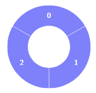
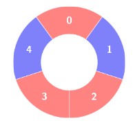
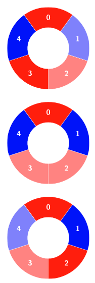

# Problem Name: Alternating Groups I

## 1. Problem Statement
There is a circle of red and blue tiles. You are given an array of integers `colors`, where the color of tile `i` is represented by `colors[i]`:
- `colors[i] == 0` means that tile `i` is red.
- `colors[i] == 1` means that tile `i` is blue.

Every 3 contiguous tiles in the circle with alternating colors (where the middle tile has a different color from its left and right tiles) is called an *alternating group*. Return the number of alternating groups.

*Note*: Since `colors` represents a circle, the first and last tiles are considered next to each other.

## 2. Example Inputs
- **Example 1**:
  - **Input**: colors = [1, 1, 1]
  - **Output**: 0
  - **Explanation**: 

  

- **Example 2**:
  - **Input**: colors = [0, 1, 0, 0, 1]
  - **Output**: 3
  - **Explanation**: 

  

  *Alternating groups*
  
  

## 3. Brute Force Approach

### a. Approach
Check every triplet of tiles to see if it forms an alternating group by ensuring the middle tile has a different color from both its left and right tiles. Since `colors` is circular, ensure the last tile connects to the first tile.

### b. Steps
1. Loop through each tile, treating it as the middle tile of a triplet.
2. For each middle tile at index `i`, check tiles at `(i-1) % n` and `(i+1) % n` for alternation.
3. Count the triplet as an alternating group if conditions are met.

### c. Time & Space Complexity
- **Time Complexity**: `O(n)` where `n` is the length of `colors`.
- **Space Complexity**: `O(1)` since we only use a counter for groups.

### d. Code Snippet

```javascript
function countAlternatingGroupsBruteForce(colors) {
    let count = 0;
    const n = colors.length;

    for (let i = 0; i < n; i++) {
        let prev = colors[(i - 1 + n) % n];
        let next = colors[(i + 1) % n];
        
        if (colors[i] !== prev && colors[i] !== next) {
            count++;
        }
    }

    return count;
}
```

### e. Dry Run
- **Input**: colors = [0, 1, 0, 0, 1]
- Check each triplet in the circle, counting valid alternating groups.

## 4. Efficient Approach

### a. Approach (Sliding Window)
Use a sliding window to efficiently check each triplet in the circular sequence. This approach allows consistent movement across the array while treating it as circular.

### b. Steps
1. Initialize a sliding window that checks each group of 3 consecutive tiles.
2. Move the window one tile at a time, checking alternation for each triplet.
3. Account for the circular nature by wrapping around at the end of the array.

### c. Time & Space Complexity
- **Time Complexity**: `O(n)` for single pass through the array.
- **Space Complexity**: `O(1)` with only a counter used.

### d. Code Snippet

```javascript
function countAlternatingGroupsEfficient(colors) {
    let count = 0;
    const n = colors.length;

    for (let i = 0; i < n; i++) {
        let prev = colors[(i - 1 + n) % n];
        let next = colors[(i + 1) % n];
        
        if (colors[i] !== prev && colors[i] !== next) {
            count++;
        }
    }

    return count;
}
```

### e. Dry Run
- **Input**: colors = [0, 1, 0, 0, 1]
- Move through each triplet in the array, counting valid alternating groups.

## 5. Complexity Analysis

### a. Brute Force Time & Space Complexity
- **Time Complexity**: `O(n)`
- **Space Complexity**: `O(1)`

### b. Optimized Time and Space Complexity
- **Time Complexity**: `O(n)`
- **Space Complexity**: `O(1)`

## 6. Conclusion
Both brute force and sliding window methods achieve the same complexity for this problem. The sliding window approach, however, provides an intuitive and cleaner solution for traversing circular patterns in arrays, making it the preferred choice.
